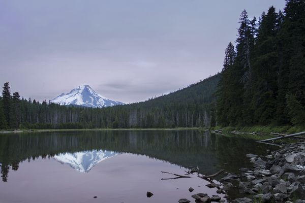
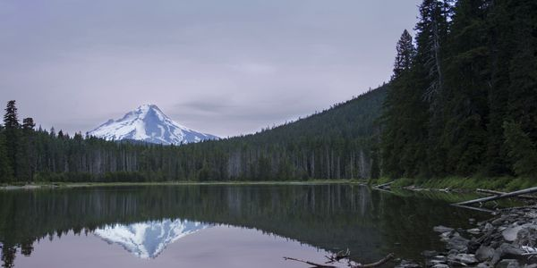
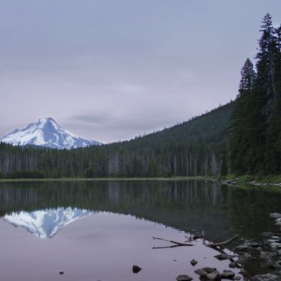
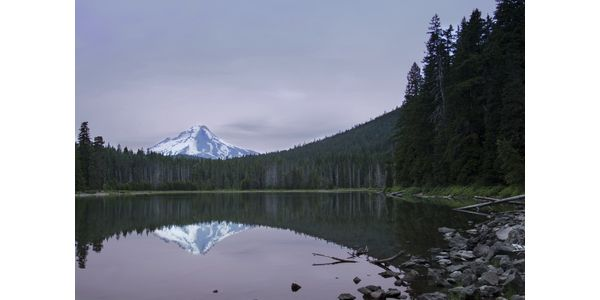
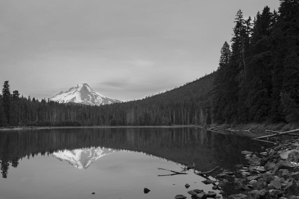
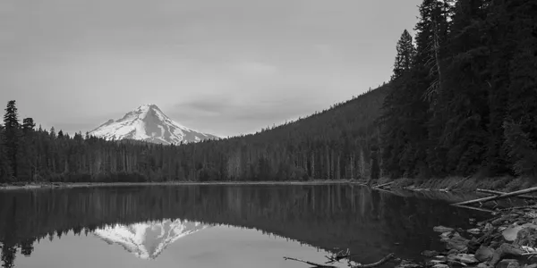

# EvaThumber 2

一个可自托管的图片变换服务。

把原图放进一个目录，启动一个 Docker，然后只需要修改 URL，就可以完成缩放、裁剪、格式转换等图片处理。

```text
/image/upload/c_fill,w_640,h_360/demo.jpg
```

不需要上传 API，不需要数据库，也不需要配置文件。

EvaThumber 不会修改原图，所有派生图片都按需生成。

[English README](README.md)

## 看看它能做什么

Demo 原图是 5184×3456。EvaThumber 不会输出单边超过 4096 像素的图片，所以下面这张就是它放在图片目录里的原文件本身，无法再通过变换 URL 取回。


缩放到 600px 宽：

```text
/image/upload/w_600/demo.jpg
```



裁剪成 600×300：

```text
/image/upload/c_fill,w_600,h_300/demo.jpg
```



裁成正方形：

```text
/image/upload/c_fill,w_400,h_400/demo.jpg
```



完整保留图片，并限制在 600×300 范围内：

```text
/image/upload/c_fit,w_600,h_300/demo.jpg
```


不裁图，使用白色背景补成 600×300：

```text
/image/upload/c_pad,w_600,h_300,b_white/demo.jpg
```



转成灰度：

```text
/image/upload/w_600/e_grayscale/demo.jpg
```



自动质量压缩并输出 WebP：

```text
/image/upload/w_600/q_auto/f_webp/demo.jpg
```


多个变换可以继续串起来：

```text
/image/upload/c_fill,w_600,h_300/e_grayscale/q_80/f_webp/demo.jpg
```



EvaThumber 基本就是这么用的。

## 运行

只需要挂载原图目录：

```bash
docker run \
  -p 8080:8080 \
  -v /path/to/your/images:/data/images:ro \
  docker.io/allovince/evathumber
```

假设：

```text
/path/to/your/images/demo.jpg
```

存在，那么直接访问：

```text
http://localhost:8080/image/upload/w_600/demo.jpg
```

第一次请求时生成图片，之后直接读取缓存。

原图目录以只读方式挂载，EvaThumber 不会修改源文件。

## 缓存

生成的图片默认缓存在：

```text
/data/cache
```

你不需要额外配置它。

使用上面的 Docker 命令时，缓存只存在于容器内部。删除容器，相当于清空全部派生图片；下次请求时会自动重新生成。

如果希望缓存跨容器保留，可以挂载一个 Volume：

```bash
docker run \
  -p 8080:8080 \
  -v /path/to/your/images:/data/images:ro \
  -v evathumber-cache:/data/cache \
  docker.io/allovince/evathumber
```

缓存里只有可重新生成的派生数据，因此通常也不需要备份。

## URL

EvaThumber 使用 Cloudinary 风格的图片变换 URL：

```text
/image/upload/{transformations}/{public_id}.{ext}
```

同时也兼容带 `cloud_name` 的形式：

```text
/{cloud_name}/image/upload/{transformations}/{public_id}.{ext}
```

同一个 transformation 中的参数使用逗号分隔：

```text
c_fill,w_600,h_400
```

多个 transformation 使用 `/` 串联：

```text
c_fill,w_600,h_400/e_grayscale/q_80/f_webp
```

所以：

```text
/image/upload/c_fill,w_600,h_400/e_grayscale/q_80/f_webp/demo.jpg
```

可以理解为：

```text
demo.jpg
    ↓
填满 600×400 并裁剪
    ↓
转灰度
    ↓
质量 80
    ↓
输出 WebP
```

## 图片变换

### 缩放

按宽度：

```text
/image/upload/w_600/demo.jpg
```

按高度：

```text
/image/upload/h_400/demo.jpg
```

按原图比例：

```text
/image/upload/w_0.5/demo.jpg
```

### 裁剪与适配

直接缩放：

```text
/image/upload/c_scale,w_600/demo.jpg
```

完整放入指定范围，不裁剪：

```text
/image/upload/c_fit,w_600,h_300/demo.jpg
```

填满指定范围，多余部分裁掉：

```text
/image/upload/c_fill,w_600,h_300/demo.jpg
```

裁剪：

```text
/image/upload/c_crop,w_600,h_400,g_center/demo.jpg
```

缩略图：

```text
/image/upload/c_thumb,w_400,h_400,g_center/demo.jpg
```

补边：

```text
/image/upload/c_pad,w_600,h_300,b_white/demo.jpg
```

限制最大尺寸，不放大小图：

```text
/image/upload/c_limit,w_1600,h_1600/demo.jpg
```

### Gravity

指定裁剪位置：

```text
/image/upload/c_fill,w_400,h_400,g_north/demo.jpg
/image/upload/c_fill,w_400,h_400,g_south/demo.jpg
/image/upload/c_fill,w_400,h_400,g_east/demo.jpg
/image/upload/c_fill,w_400,h_400,g_west/demo.jpg
```

支持：

```text
center
north
north_east
east
south_east
south
south_west
west
north_west
```

### 宽高比

```text
/image/upload/c_fill,w_600,ar_16:9/demo.jpg
```

### DPR

```text
/image/upload/c_fill,w_300,h_200,dpr_2/demo.jpg
```

最终会输出 600×400 像素图片。

### 旋转与翻转

```text
/image/upload/w_600/a_90/demo.jpg
/image/upload/w_600/a_180/demo.jpg
/image/upload/w_600/a_hflip/demo.jpg
/image/upload/w_600/a_vflip/demo.jpg
```

### 效果

灰度：

```text
/image/upload/w_600/e_grayscale/demo.jpg
```

反色：

```text
/image/upload/w_600/e_negate/demo.jpg
```

### 图片质量

指定质量：

```text
/image/upload/w_600/q_80/demo.jpg
```

自动质量：

```text
/image/upload/w_600/q_auto/demo.jpg
/image/upload/w_600/q_auto:best/demo.jpg
/image/upload/w_600/q_auto:good/demo.jpg
/image/upload/w_600/q_auto:eco/demo.jpg
/image/upload/w_600/q_auto:low/demo.jpg
```

`q_auto` 使用 EvaThumber 自己的本地内容自适应策略，并不等价于 Cloudinary 的专有感知质量算法。

### 输出尺寸上限

每次请求的最终结果，单边不能超过 4096 像素，总像素不能超过 1600 万。旋转、翻转、效果与质量参数都不会改变像素总量，因此单独作用在大尺寸原图上会被拒绝，返回 `413 image_too_large`。请在同一个请求里先缩放，就像上面所有示例那样。

### 图片格式

可以直接通过 URL 扩展名指定输出格式：

```text
/image/upload/w_600/demo.webp
```

也可以使用 `f_`：

```text
/image/upload/w_600/f_webp/demo.jpg
/image/upload/w_600/f_avif/demo.jpg
/image/upload/w_600/f_png/demo.jpg
```

还支持自动格式协商：

```text
/image/upload/w_600/f_auto/demo.jpg
```

EvaThumber 会根据请求中的 `Accept` Header 决定输出格式。

## 支持格式

输入：

```text
JPEG
PNG
WebP
AVIF
GIF（仅静态图片）
```

输出：

```text
JPEG
PNG
WebP
AVIF
GIF
```

## EvaThumber 不做什么

EvaThumber 2 有意保持较小的功能边界。

目前不支持：

- 远程图片或 S3 图片源
- 动图处理
- SVG / PDF
- 图片或文字图层
- 人脸检测
- AI 自动 Gravity
- 圆角
- 模糊、锐化等风格化效果
- 视频处理
- Upload API
- Admin API

不支持的变换会直接返回错误，不会偷偷使用一个“差不多”的算法代替。

## 生产环境行为

EvaThumber 2 基于 PHP 8.5、FrankenPHP 和 libvips。

正式 Docker 镜像：

- 支持 `linux/amd64` 和 `linux/arm64`
- 以非 root 用户运行
- 原图目录只读
- 缓存结果原子发布
- 同一张图片的并发生成会自动合并
- 高负载下使用有界队列
- 过载时返回 `503`，而不是无限堆积请求
- 支持 `ETag`
- 支持 `Last-Modified`
- 支持条件请求和 `304`
- 提供 `/healthz`
- 提供 `/readyz`

默认配置就是正常使用配置，不要求额外调参。

如果需要了解实际并发、性能和进程异常恢复结果，可以查看：

```text
bench/
docs/
```

仓库中保留了 EvaThumber 2.0 发布时使用的压测与 crash recovery 验证结果。

## 作为 PHP Library 使用

除了直接运行 HTTP 服务，也可以单独使用图片变换核心：

```php
use EvaThumber\Image\Pipeline;
use EvaThumber\Source\LocalSource;
use EvaThumber\Transformation\Parser;

$source = (new LocalSource('/path/to/images'))->resolve('demo');

(new Pipeline())->write(
    $source,
    (new Parser())->parse('c_fill,w_600,h_400'),
    '/tmp/demo.webp',
    'webp'
);
```

Library Core 不依赖 HTTP Server、HTTP Cache 或请求调度层。

## 开发

```bash
composer install
composer test
composer analyse
```

架构、测试和发布相关文档见：

[`docs/`](docs/)

## 从 EvaThumber 1.x 升级

EvaThumber 最早发布于 2012 年，当时只是一个很小的 PHP 图片缩略图 Library。

V2 是一次完整重写。

底层实现、URL 规范和部署方式都已经发生变化，但最初的想法其实一直没有变：

> 改一下 URL，就得到你需要的图片。

从 EvaThumber 1.x 迁移请看：

[`docs/migration-v1.md`](docs/migration-v1.md)

## License

BSD-3-Clause，见 [LICENSE](LICENSE)。

### Demo 图片

`demo.jpg` 使用 **Lake Mountain Landscape**。

作者：Bonnie Moreland。

图片以 CC0 / Public Domain 发布。

来源：Wikimedia Commons。